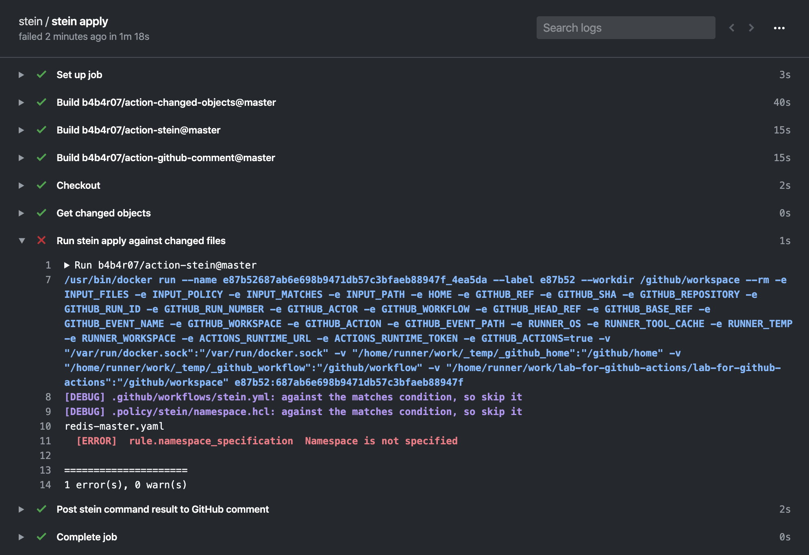
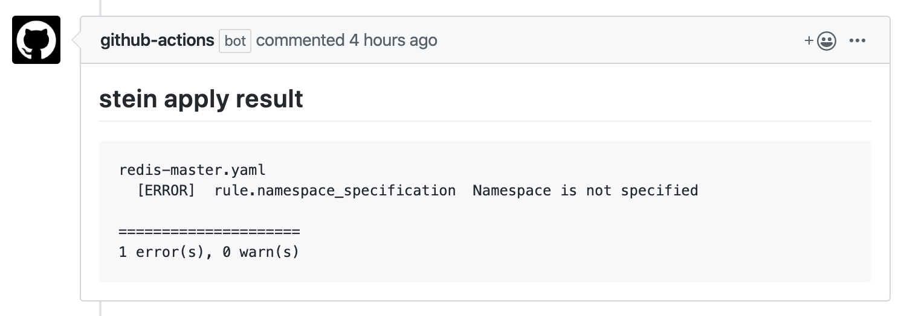

action-stein
============

[](https://github.com/b4b4r07/action-stein/releases)



Run [stein apply](https://github.com/b4b4r07/stein) command with GitHub Actions

You can use the fixed version from: [Releases](https://github.com/b4b4r07/action-stein/releases/latest)

## Usage

A whole example is here:

```yaml
name: stein

on: [pull_request]

jobs:
  stein:
    name: stein apply
    runs-on: ubuntu-latest
    steps:
    - name: Checkout
      uses: actions/checkout@v1
    - name: Get changed objects
      uses: b4b4r07/action-changed-objects@master
      with:
        added: 'true'
        deleted: 'false'
        modified: 'true'
      id: objects
    - name: Run stein apply against changed files
      uses: b4b4r07/action-stein@master
      if: steps.objects.outputs.changed
      with:
        files: ${{ steps.objects.outputs.changed }}
        matches: '*.yaml'
      id: stein
    - name: Post stein command result to GitHub comment
      uses: b4b4r07/action-github-comment@master
      if: always() && steps.stein.outputs.result
      with:
        body: |
          ## stein apply result
          ```
          ${{ steps.stein.outputs.result }}
          ```
      env:
        GITHUB_TOKEN: ${{ secrets.GITHUB_TOKEN }}
        LOG: trace
```

If you want to run [stein](https://github.com/b4b4r07/stein) command against only changed config files, you need to use [b4b4r07/action-changed-objects](https://github.com/b4b4r07/action-changed-objects) to get the changed files in Git commit. It defaults to compare with checkout-ed branch and origin/master branch.

In addition, you can filter the changed files, for example, let's say you want to stein only changed JSON and YAML files:

```yaml
      with:
        files: ${{ steps.objects.outputs.changed }}
        matches: '*.json manifests/*.yaml'
```

Besides, if you want to post the `stein apply` command result on your pull requests, you need to set the step `Post stein command result to GitHub comment`. The contents of `body` is the message itself. You can configure it as Markdown. For more details, please see also [b4b4r07/action-github-comment](https://github.com/b4b4r07/action-github-comment).

To put the comment on GitHub even if the previous `stein` step is failed, you need to set [`always()` condition](https://help.github.com/en/actions/reference/contexts-and-expression-syntax-for-github-actions#job-status-check-functions) like this:

```yaml
      if: always() && steps.stein.outputs.result
```

This means the comment will be posted to GitHub regardless of previous build step but at least the output of previous step needs to be not empty.



## Customizing

### inputs

The following are optional as `step.with` keys

| Name       | Type   | Description                                                               | Default |
| ---------- | ------ | ------------------------------------------------------------------------- | -------- |
| `path`     | String | Path to directory where config files are located                          | `.`      |
| `policy`   | String | Path to the stein policy files directory                                  | `.policy`|
| `files`    | String | A list of config file to be tested by stein. Separated by a space         |          |
| `matches`  | String | A list of cases to be tested (e.g. "*.yaml *.json"). Separated by a space |          |

When providing a `path` and `files` at the same time, `files` will be attempted first, then falling back on `path` if the files can not be got from.

### outputs

The following outputs can be accessed via `${{ steps.<step-id>.outputs }}` from this action

| Name     | Type   | Description                   |
| -------- | ------ | ----------------------------- |
| `result` | String | Outputs of `stein` command |

### environment variables

The following are as `step.env` keys

| Name | Description |
| ---- | ----------- |
| n/a  | n/a         |

## License

[MIT](https://b4b4r07.mit-license.org/)

